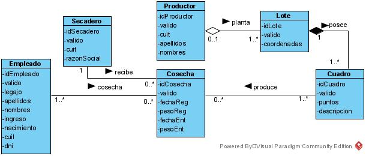
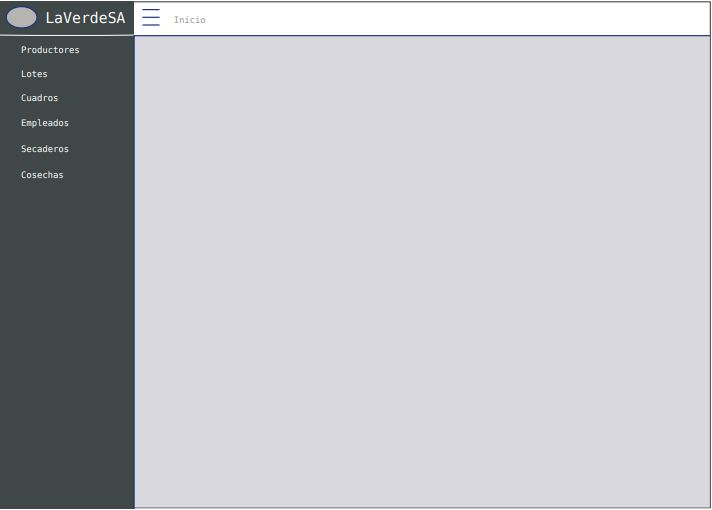
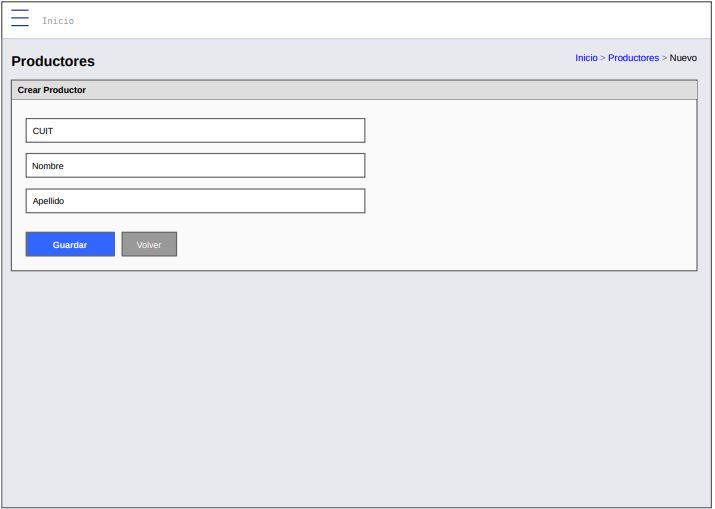
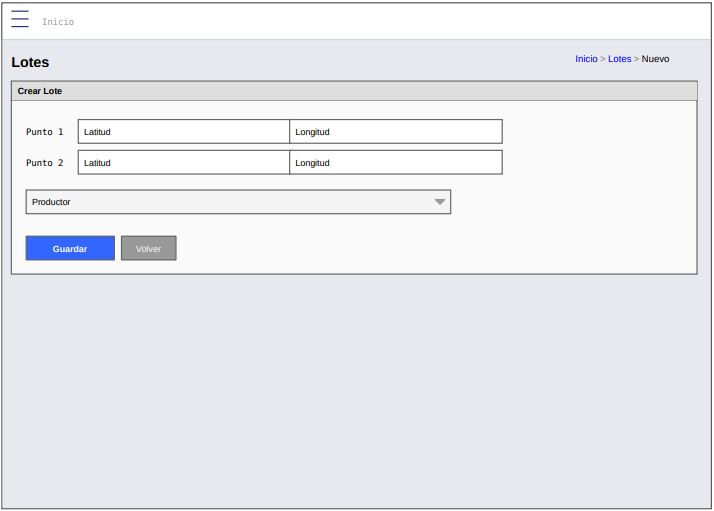
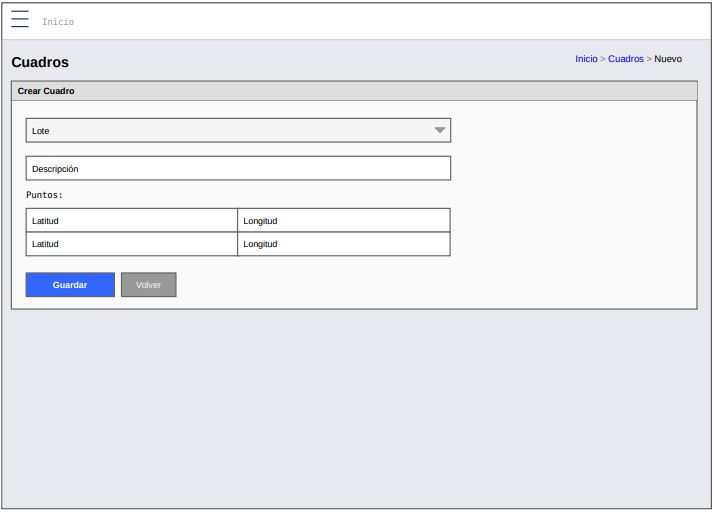
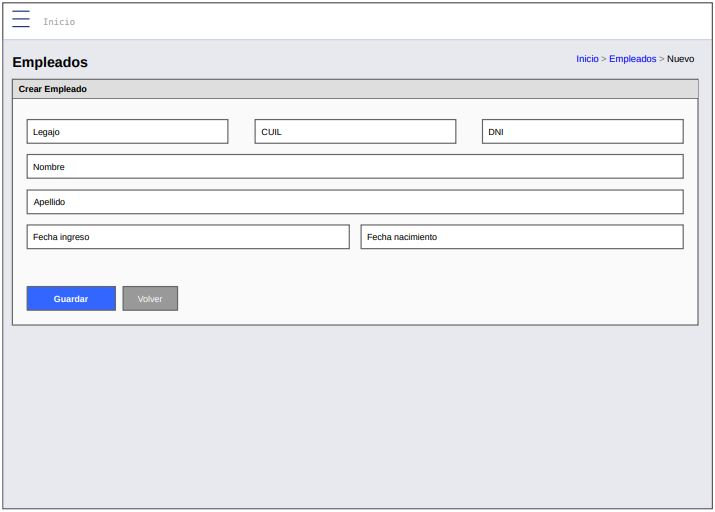
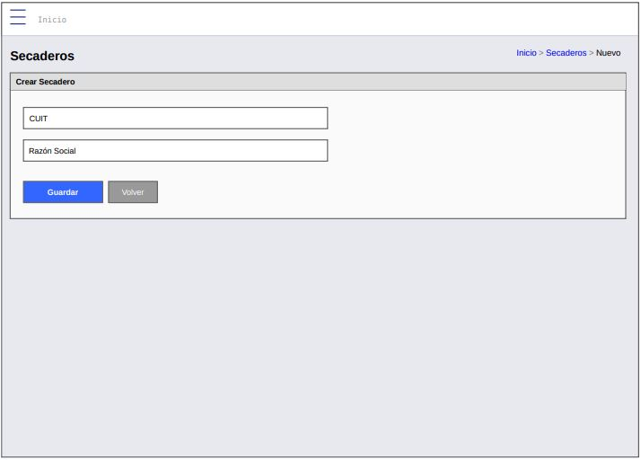
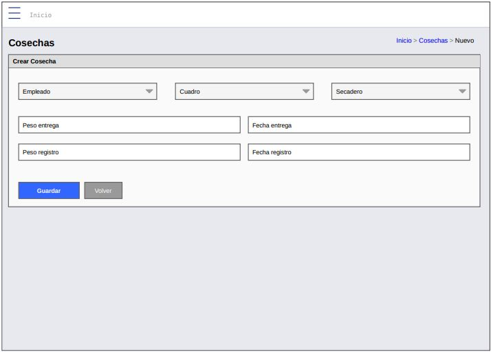

# Iteración vacaciones
## Trabajo en equipo:
El líder de equipo para esta iteración será Rodrigo Lionel Antoniak y se permitira el avance mayor posible de cada miembro, considerando que obtuvieron buenos resultados en la iteración pasada. Los miembros estarán en contacto constante para informar sobre los avances y dónde tiene dificultades cada uno, tratando de lograr incentivar la combinación y lograr funcionar la estrategia de reuniones que simulen un encuentro presencial.
## Diseño OO:

## Wireframes:

## Casos de uso:
Para esta iteración, se posee todos los CRUD de todos los perfiles; por lo tanto, para cada clase se posee los casos de uso de la iteración anterior (para conocer los CRUD de cada perfil, revise erp.md):
## Backlog de iteraciones:
(Aquí debería incluirse la totalidad de requerimientos funcionales y no funcionales, lo cual es similar a todas las historias de usuario que se encuentran en el mapa de camino o roadmap de la iteración 0; esto es sin incluir la iteración 5, que es la actual)
## Tareas:
- Realizar las modificaciones pertinentes del sistema original.
- Diseñar el wireframe.
- Implementar varios perfiles.
- Evaluar con pruebas si el sistema funciona correctamente.
## Retrospectiva:
Se ha logrado implementar varios perfiles dentro del sistema y ha sido modificado para tener mayor valor.